# Task 1: Install MySQL server <br>

# Task 2: Create a new database named website.

1.使用 SQL 命令創建新的 DATABASE website:<br>
<span style="color:red">CREATE DATABASE website;<br>
USE website;</span>
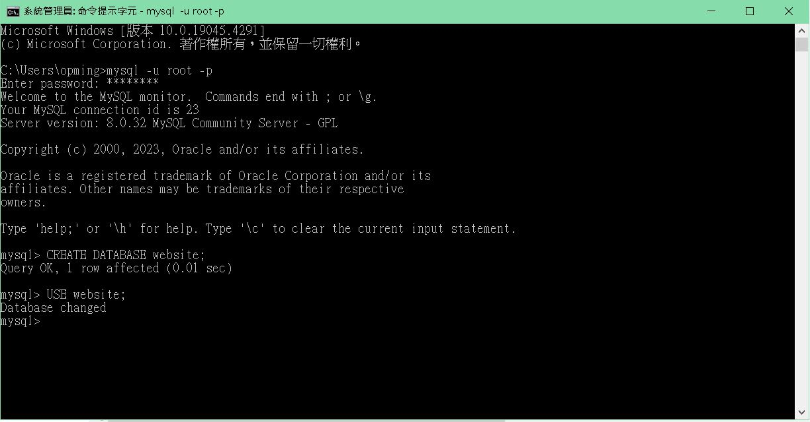

2.使用 SQL 命令:<br>
```
CREATE TABLE member (
id BIGINT AUTO_INCREMENT PRIMARY KEY COMMENT 'Unique ID',
name VARCHAR(255) NOT NULL COMMENT 'Name',
username VARCHAR(255) NOT NULL COMMENT 'Username',
password VARCHAR(255) NOT NULL COMMENT 'Password',
follower_count INT UNSIGNED NOT NULL DEFAULT 0 COMMENT 'Follower Count',
time DATETIME NOT NULL DEFAULT CURRENT_TIMESTAMP COMMENT 'Signup Time'
);
DESCRIBE member;
```
show tables;
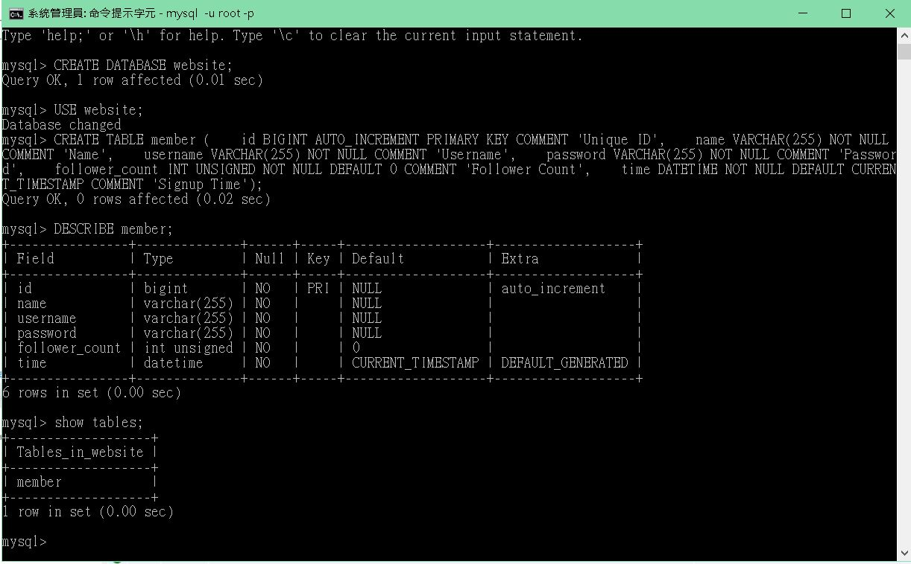

# Task 3: SQL CRUD <br>

1.INSERT a new row to the member table where name, username and password must be set to test.INSERT additional 4 rows with arbitrary data.<br>
使用 SQL 命令:<br>
<span style="color:red">INSERT INTO member (name, username, password) VALUES ('test', 'test', 'test');</span><br>
使用 SQL 命令插入任意 4 筆資料:<br>
<span style="color:red">
INSERT INTO member (name, username, password, follower_count, time) <br>
VALUES <br>
('John Doe', 'john_doe', 'password123', 100, '2024-04-29 10:00:00'),<br>
('Janest Smith', 'jane_smith', 'hello123', 200, '2024-04-29 11:00:00'),<br>
('Michael Johnson', 'michael_j', 'qwerty', 50, '2024-04-29 12:00:00'),<br>
('Emily Brown', 'emily_b', 'abc123', 300, '2024-04-29 13:00:00');
</span><br>
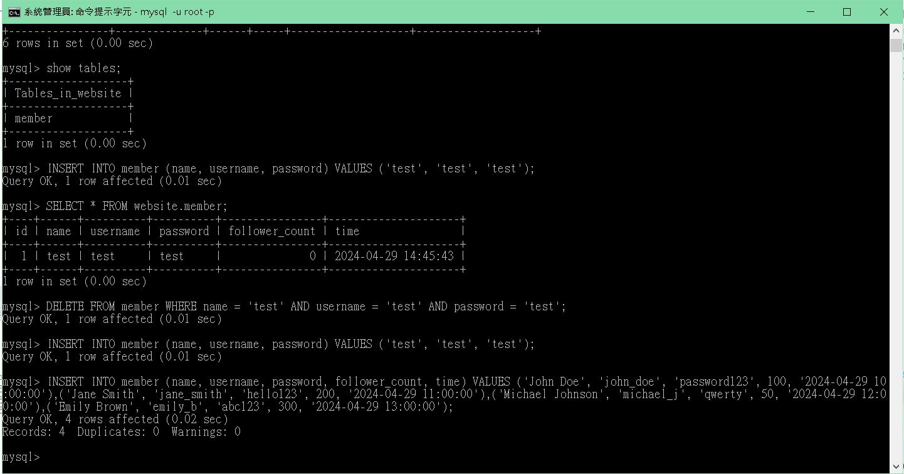
2.SELECT all rows from the member table<br>
使用 SQL 命令:<br>
<span style="color:red">
SELECT \* FROM website.member;
</span>
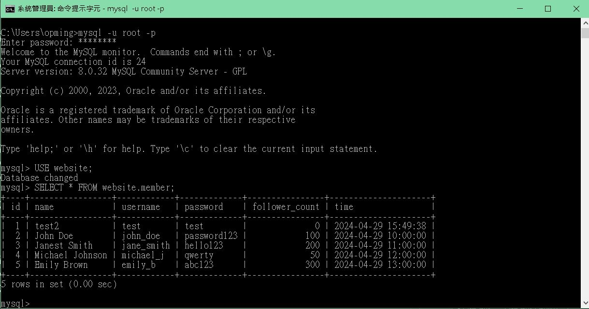

3.SELECT all rows from the member table, in descending order of time<br>
使用 SQL 命令:<br>
<span style="color:red">
SELECT \* FROM website.member ORDER BY time DESC;
</span>
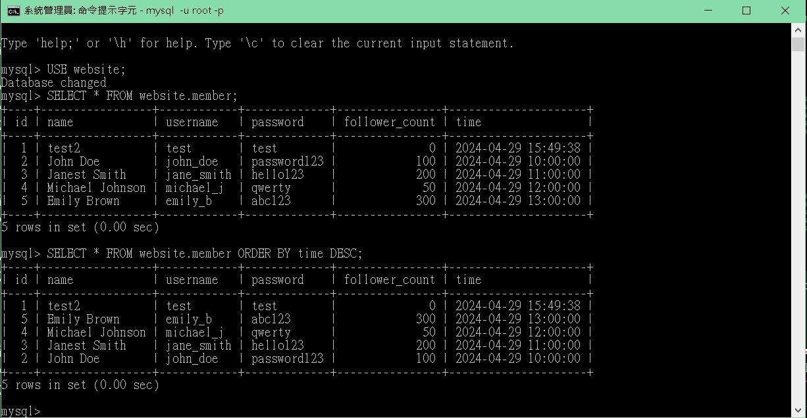
4.SELECT total 3 rows, second to fourth, from the member table, in descending order of time. Note: it does not mean SELECT rows where id are 2, 3, or 4<br>
使用 SQL 命令:<br>
<span style="color:red">
SELECT \* FROM member ORDER BY time DESC LIMIT 2,3;
</span>
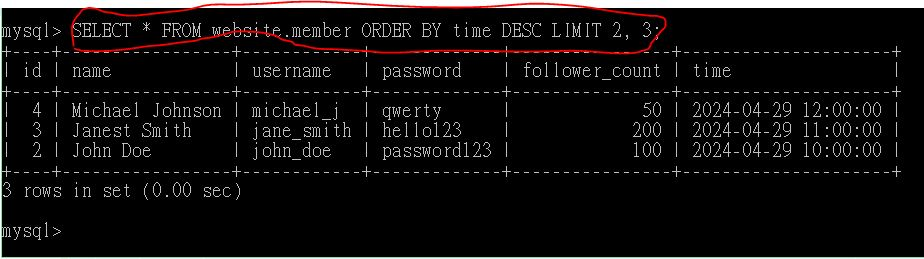
5.SELECT rows where username equals to test.<br>
使用 SQL 命令:<br>
<span style="color:red">
SELECT \* FROM member WHERE username = 'test';
</span>
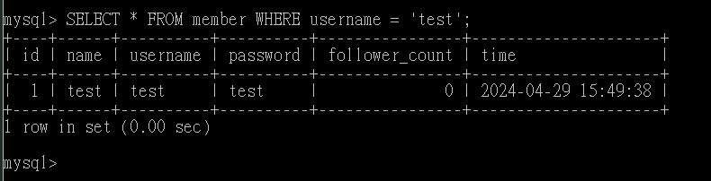 <br>
6.SELECT rows where name includes the es keyword<br>
使用 SQL 命令:<br>
<span style="color:red">
SELECT \_ FROM member WHERE name LIKE '%es%';
</span>
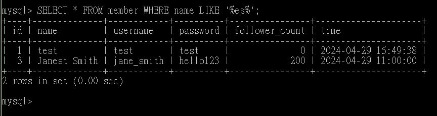 <br>
7.SELECT rows where both username and password equal to test.<br>
使用 SQL 命令:<br>
<span style="color:red">
SELECT \* FROM member WHERE username = 'test' AND password = 'test';
</span>
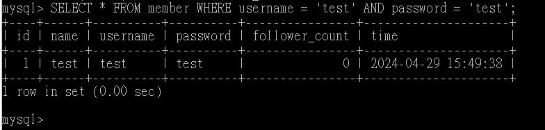 <br>
8.UPDATE data in name column to test2 where username equals to test.<br>
使用 SQL 命令:<br>
<span style="color:red">
UPDATE member SET name = 'test2' WHERE username = 'test';
</span>
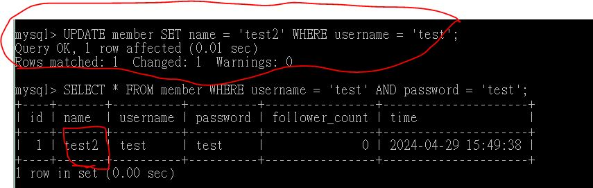 <br>

# Task 4: SQL Aggregation Functions <br>

1.SELECT how many rows from the member table<br>
使用 SQL 命令:<br>
<span style="color:red">
SELECT COUNT(\*) AS total_rows FROM member;
</span>
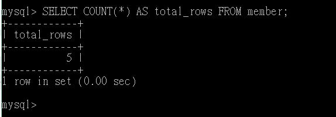 <br>
2.SELECT the sum of follower_count of all the rows from the member table.<br>
使用 SQL 命令:<br>
<span style="color:red">
SELECT SUM(follower_count) AS total_follower_count FROM member;
</span>
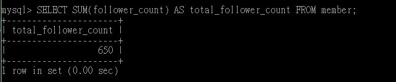 <br>
3.SELECT the average of follower_count of all the rows from the member table.<br>
使用 SQL 命令:<br>
<span style="color:red">
SELECT AVG(follower_count) AS average_follower_count FROM member;
</span>
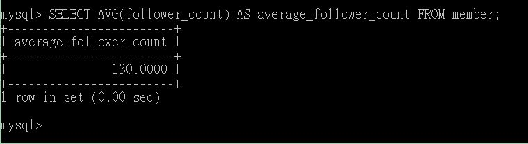 <br>
4.SELECT the average of follower_count of the first 2 rows, in descending order of follower_count, from the member table.<br>
使用 SQL 命令:<br>
<span style="color:red">
SELECT AVG(follower_count) AS average_follower_count<br>
FROM (<br>
SELECT follower_count<br>
FROM member<br>
ORDER BY follower_count DESC<br>
LIMIT 2<br>
) AS subquery;
</span>
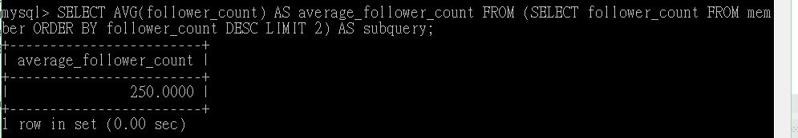 <br>

# Task 5: SQL JOIN<br>

1.Create a new table named message, in the website database. designed as below:<br>
使用 SQL 命令:<br>
<span style="color:red">
CREATE TABLE message (<br>
id BIGINT AUTO_INCREMENT PRIMARY KEY COMMENT 'Unique ID',<br>
member_id BIGINT NOT NULL,<br>
content VARCHAR(255) NOT NULL COMMENT 'Content',<br>
like_count INT UNSIGNED NOT NULL DEFAULT 0 COMMENT 'Like Count',<br>
time DATETIME NOT NULL DEFAULT CURRENT_TIMESTAMP COMMENT 'Publish Time',<br>
FOREIGN KEY (member_id) REFERENCES member(id)<br>
);<br>
DESCRIBE message;<br>
</span>
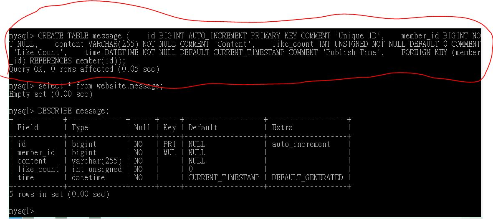 <br>

2.SELECT all messages, including sender names. We have to JOIN the member table to get that.<br>
使用 SQL 命令:<br>
<span style="color:red">
SELECT message.id, message.content, message.like_count, message.time, member.name AS sender_name FROM message JOIN member ON message.member_id = member.id;
</span>
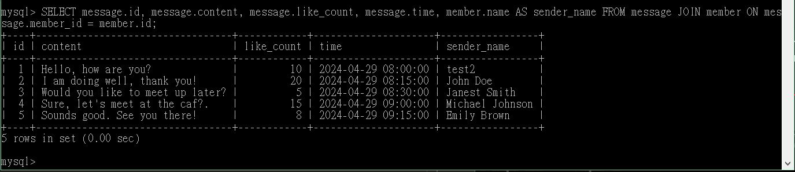 <br>
3.SELECT all messages, including sender names, where sender username equals to test. We have to JOIN the member table to filter and get that.<br>
使用 SQL 命令:<br>
<span style="color:red">
SELECT message.id, message.content, message.like_count, message.time,member.name AS sender_name FROM message JOIN member ON message.member_id = member.id WHERE member.username = 'test';
</span>
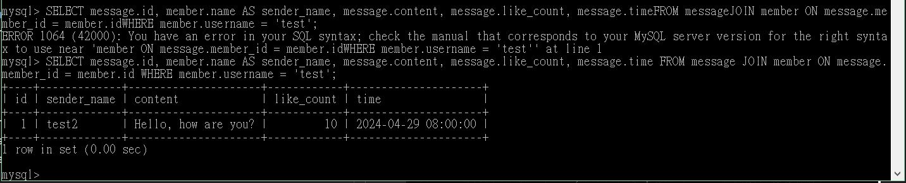 <br>
4.Use SELECT, SQL Aggregation Functions with JOIN statement, get the average like
count of messages where sender username equals to test<b>
使用 SQL 命令:<br>
<span style="color:red">
SELECT AVG(message.like_count) AS avg_like_count FROM message JOIN member ON message.member_id = member.id WHERE member.username = 'test';
</span>
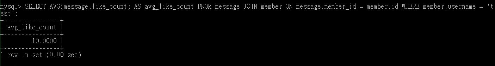 <br>
5.Use SELECT, SQL Aggregation Functions with JOIN statement, get the average like count of messages GROUP BY sender username <br>
使用 SQL 命令:<br>
<span style="color:red">
SELECT AVG(message.like_count) AS avg_like_count FROM message JOIN member ON message.member_id = member.id WHERE member.username = 'test';
</span>
 <br>
