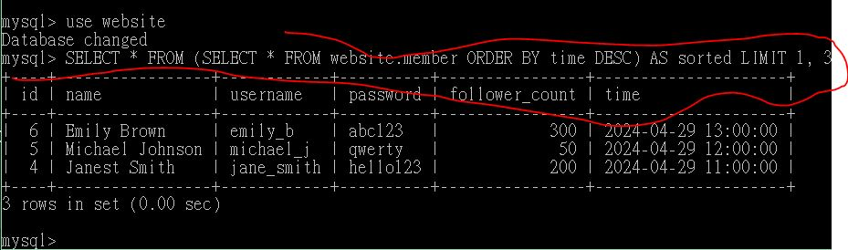

# Task 1: Install MySQL server

# Task 2: Create a new database named website.

1.使用 SQL 命令創建新的 DATABASE 名稱為 website:

```
CREATE DATABASE website;
USE website;
```


2.設定 DATABASE website 的資料庫規格

使用 SQL 命令:

```
CREATE TABLE member (
    id BIGINT AUTO_INCREMENT PRIMARY KEY COMMENT 'Unique ID',
    name VARCHAR(255) NOT NULL COMMENT 'Name',
    username VARCHAR(255) NOT NULL COMMENT 'Username',
    password VARCHAR(255) NOT NULL COMMENT 'Password',
    follower_count INT UNSIGNED NOT NULL DEFAULT 0 COMMENT 'Follower Count',
    time DATETIME NOT NULL DEFAULT CURRENT_TIMESTAMP COMMENT 'Signup Time'
);
DESCRIBE member;
show tables;
```


# Task 3: SQL CRUD

1.INSERT a new row to the member table where name, username and password must be set to test.INSERT additional 4 rows with arbitrary data.

使用 SQL 命令創建 name, username, password 都是'test'的資料:

```
INSERT INTO member (name, username, password) VALUES ('test', 'test', 'test');
```

使用 SQL 命令插入任意 4 筆資料:

```
INSERT INTO member (name, username, password, follower_count, time)
VALUES
('John Doe', 'john_doe', 'password123', 100, '2024-04-29 10:00:00'),
('Janest Smith', 'jane_smith', 'hello123', 200, '2024-04-29 11:00:00'),
('Michael Johnson', 'michael_j', 'qwerty', 50, '2024-04-29 12:00:00'),
('Emily Brown', 'emily_b', 'abc123', 300, '2024-04-29 13:00:00');
```


2.SELECT all rows from the member table

使用 SQL 命令顯示 member table:

```
SELECT * FROM website.member;
```


3.SELECT all rows from the member table, in descending order of time

使用 SQL 命令顯示 member table 並且根據時間遞減來排序:

```
SELECT * FROM website.member ORDER BY time DESC;
```


4.SELECT total 3 rows, second to fourth, from the member table, in descending order of time. Note: it does not mean SELECT rows where id are 2, 3, or 4

使用 SQL 命令:

```
SELECT * FROM website.member ORDER BY time DESC LIMIT 2,3;
```



5.SELECT rows where username equals to test.

使用 SQL 命令:

```
SELECT * FROM member WHERE username = 'test';
```


6.SELECT rows where name includes the es keyword

使用 SQL 命令:

```
SELECT * FROM member WHERE name LIKE '%es%';
```


7.SELECT rows where both username and password equal to test.

使用 SQL 命令:

```
SELECT * FROM member WHERE username = 'test' AND password = 'test';
```


8.UPDATE data in name column to test2 where username equals to test.

使用 SQL 命令:

```
UPDATE member SET name = 'test2' WHERE username = 'test';
```


# Task 4: SQL Aggregation Functions

1.SELECT how many rows from the member table
使用 SQL 命令:

```
SELECT COUNT(*) AS total_rows FROM member;
```


2.SELECT the sum of follower_count of all the rows from the member table.

使用 SQL 命令:

```
SELECT SUM(follower_count) AS total_follower_count FROM member;
```


3.SELECT the average of follower_count of all the rows from the member table.

使用 SQL 命令:

```
SELECT AVG(follower_count) AS average_follower_count FROM member;
```


4.SELECT the average of follower_count of the first 2 rows, in descending order of follower_count, from the member table.

使用 SQL 命令:

```
SELECT AVG(follower_count) AS average_follower_count
FROM (
    SELECT follower_count
    FROM member
    ORDER BY follower_count DESC
    LIMIT 2
) AS subquery;
```


# Task 5: SQL JOIN

1.Create a new table named message, in the website database. designed as below:

使用 SQL 命令:

```
CREATE TABLE message (
    id BIGINT AUTO_INCREMENT PRIMARY KEY COMMENT 'Unique ID',
    member_id BIGINT NOT NULL COMMENT 'Member ID for Message Sender',
    content VARCHAR(255) NOT NULL COMMENT 'Content',
    like_count INT UNSIGNED NOT NULL DEFAULT 0 COMMENT 'Like Count',
    time DATETIME NOT NULL DEFAULT CURRENT_TIMESTAMP COMMENT 'Publish Time',
    FOREIGN KEY (member_id) REFERENCES member(id)
);
DESCRIBE message;
```


2.SELECT all messages, including sender names. We have to JOIN the member table to get that.

使用 SQL 命令:

```
SELECT message.id, message.content, message.like_count, message.time, member.name AS sender_name FROM message JOIN member ON message.member_id = member.id;
```


3.SELECT all messages, including sender names, where sender username equals to test. We have to JOIN the member table to filter and get that.

使用 SQL 命令:

```
SELECT message.id, message.content, message.like_count, message.time,member.name AS sender_name FROM message JOIN member ON message.member_id = member.id WHERE member.username = 'test';
```


4.Use SELECT, SQL Aggregation Functions with JOIN statement, get the average like
count of messages where sender username equals to test

使用 SQL 命令:

```
SELECT AVG(message.like_count) AS avg_like_count FROM message JOIN member ON message.member_id = member.id WHERE member.username = 'test';
```


5.Use SELECT, SQL Aggregation Functions with JOIN statement, get the average like count of messages GROUP BY sender username

使用 SQL 命令:

```
SELECT member.username, AVG(message.like_count) AS avg_like_count FROM message JOIN member ON message.member_id = member.id GROUP BY member.username;
```


# Use mysqldump

```
mysqldump -u root -p website > data.sql
```


